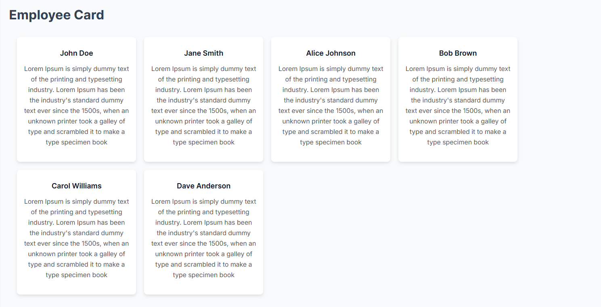
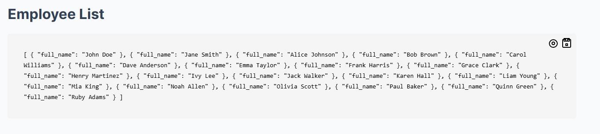
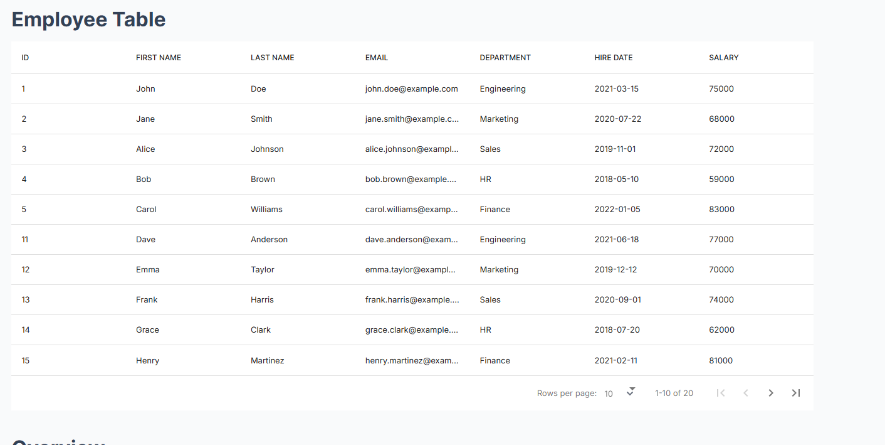

# 📄 DatabaseQueryRenderer

The `DatabaseQueryRenderer` component in Astro allows you to fetch data from an SQLite database and render it in different layouts such as **Table, JSON List, or Card List**.

## 🚀 Usage

Import the component in your Astro file:

```tsx
import DatabaseQueryRenderer from "../../../components/database-query-renderer/DatabaseQueryRenderer.astro";
```

Then, use it in your Astro template by passing the necessary props:

### **Employee List in Card Format**

```tsx
<DatabaseQueryRenderer
  title="Employee Card"
  layout="card"
  dbName="employee_db.db"
  table="employees"
  fields=[
    "first_name || ' ' || last_name AS title",
    `"Lorem Ipsum is simply dummy text of the printing and typesetting industry..." AS description`
  ]
  where=""
  orderBy="first_name ASC"
  limit="6"
/>
```

### ⚠️ Important Note

All layouts can use any query, but the **card layout** must have a `title` field in `fields`. The `description` field is optional.

### 🎨 Layout Options

| Layout Type | Description                                    |
| ----------- | ---------------------------------------------- |
| `table`     | Displays the query result in a tabular format. |
| `json`      | Renders the query result as a JSON list.       |
| `card`      | Shows the data as a card-based layout.         |

### 🔹 More Examples

#### **Employee List in JSON Format**

```tsx
<DatabaseQueryRenderer
  title="Employee List"
  layout="json"
  dbName="employee_db.db"
  fields={['*']}
  table="employees"
  where=""
  orderBy=""
  limit="2"
/>
```

#### **Employee Table View**

```tsx
<DatabaseQueryRenderer
  title="Employee Table"
  layout="table"
  dbName="employee_db.db"
  fields={['*']}
  table="employees"
  where=""
  orderBy=""
  limit="2"
/>
```

## 📷 Screenshots

Below are some example images showcasing the component in different layouts:

### Card layout



### JSON layout



### Table layout



## ⚙️ Props

| Prop       | Type       | Description                                   |
| ---------- | ---------- | --------------------------------------------- |
| `title`    | `string`   | Title of the section.                         |
| `layout`   | `"table" \| "json" \| "card"` | Specifies the display format. |
| `dbName`   | `string`   | Name of the SQLite database file.             |
| `table`    | `string`   | Name of the table to query.                   |
| `fields`   | `string[]` | Array of fields to select. Defaults to `*`.   |
| `where`    | `string`   | SQL WHERE clause.                             |
| `orderBy`  | `string`   | SQL ORDER BY clause.                          |
| `limit`    | `number`   | Limit the number of results.                  |

## 🛠️ Error Handling

- If the database does **not** exist, an error message will be displayed instead of crashing the app.
- If `layout` is "card" and `fields` does not include a `title` field, an error will be thrown where the component is used.
- If an invalid `layout` is provided, a **default message** is shown.

## 📌 Notes

- The database file (`dbName`) must be present in the working directory.
- Ensure your SQL query returns data in a format suitable for the selected layout.

