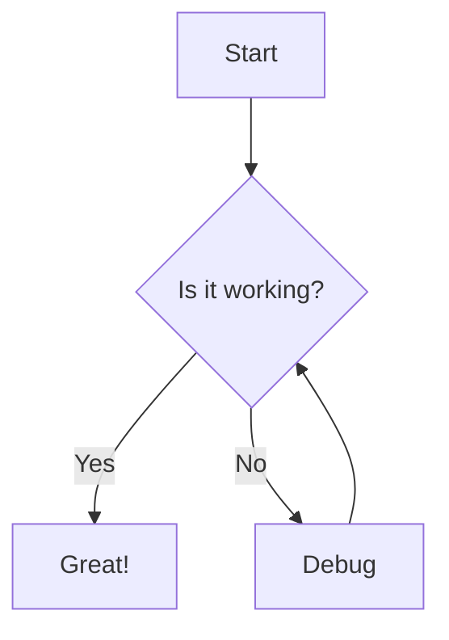
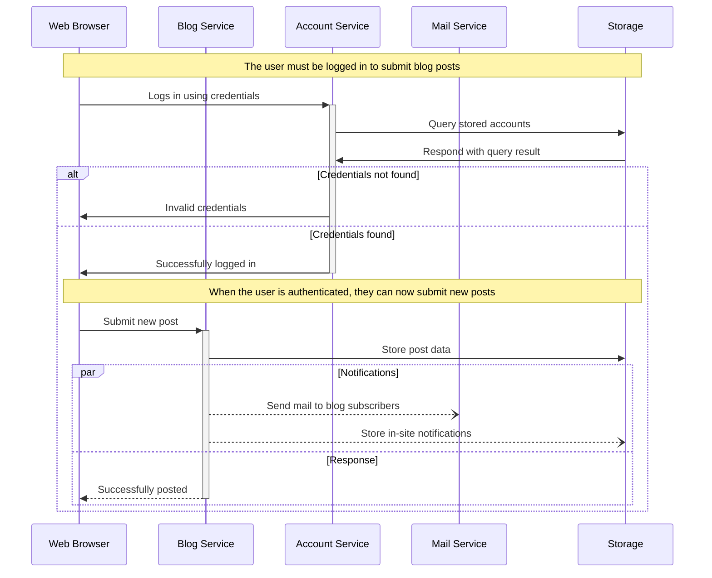

# Diagrams

Mermaid and Planthtml are tools for creating diagrams using simple text-based syntax. This document provides a guide on how to use both tools effectively in Markdown files.

## Mermaid Diagram

#### Example: Using Mermaid in Markdown (.md)

```
---
title: "Flowchart Example"
---



Use the following sample code snippet to add a Mermaid diagram in a Markdown file and generate the corresponding diagram:

```



## Plantuml Diagram

Use the following code snippet to add a Plantuml diagram in mark down file and generate the corresponding diagram:


```


<figure class="beoe mermaid">


</figure>

<style>
.beoe{
    background-color: #fff;
}
</style>


