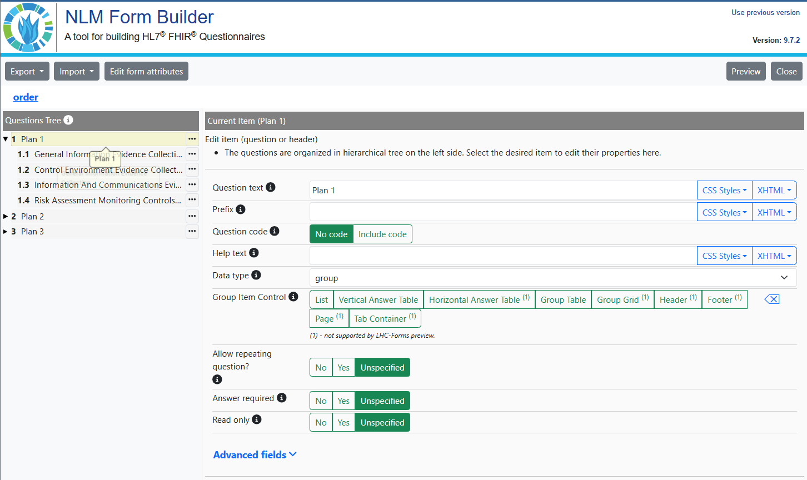

# EOH Astro 5 Theme  

## Overview  

The **EOH Astro 5 Theme** is a highly customizable and versatile Astro-based theme. It comes equipped with essential components like breadcrumbs, headers, footers, and sidebars for seamless navigation. The theme supports dynamic content creation, including features such as blog collections, landing pages, static pages, and GitHub Discussions integration.

## Features  

- **Header and Footer**: Easily customizable components.  
- **Blog Pages**:  
  - Blog listing page.  
  - Blog detail page.  
- **Expectations & Outcomes Collection**:  
  - Generates a sidebar menu from items in `src/content`.  
  - Sidebar is a customizable component.  
- **Landing Page**: Includes cards, mission, and vision sections etc.  
- **Custom Pages**: Easily add new pages as needed.  

## GitHub Discussions Integration  

This theme demonstrates integration with GitHub Discussions using the `github-discussions-blog-loader`.

### Setup  

1. **Copy Environment Variables**:  
   Copy `.env.example` to `.env`:  

   ```bash
   cp .env.example .env
   ```

2. **Configure Environment Variables**:  
   Update the `.env` file with the following values:
   - `PUBLIC_GITHUB_TOKEN`: GitHub Personal Access Token with read access to discussions.  
   - `PUBLIC_GITHUB_REPO_NAME`: Repository name.  
   - `PUBLIC_GITHUB_OWNER_NAME`: Repository owner (user or organization).  

   Example:

   ```env
   PUBLIC_GITHUB_TOKEN=ghp_xxxxxxxxxxxxxxxxxxx
   PUBLIC_GITHUB_REPO_NAME=your-repo-name
   PUBLIC_GITHUB_OWNER_NAME=your-username
   ```

3. **Use the GitHub Discussion Loader Component**:  
   Import and include the component in your Astro templates:  

   ```astro
   ---
   import GithubDiscussionLoader from "../components/github_discussion/githubDiscussion.astro";
   ---
   <GithubDiscussionLoader />
   ```

## ZITADEL Authentication Component  

Easily integrate ZITADEL authentication into your project.  

1. **Update Environment Variables**:  
   Add the following to the `.env` file:  

   ```env
   PUBLIC_ZITADEL_CLIENT_ID="your-client-id"
   PUBLIC_ZITADEL_AUTHORITY="your-authority"
   PUBLIC_ZITADEL_REDIRECT_URI="your-redirect-uri"
   PUBLIC_ZITADEL_LOGOUT_REDIRECT_URI="your-logout-redirect-uri"
   PUBLIC_ZITADEL_ORGANIZATION_ID="your-organization-id"
   PUBLIC_ZITADEL_PROJECT_ID="your-project-id"
   PUBLIC_ZITADEL_API_TOKEN = xxxxxxxxxxxxxxxxxx

   ```

2. **Use the Authentication Component**:  
   Import and use it in your templates:  

   ```astro
   ---
   import { Authentication } from "../components/zitadel-authentication";
   import { zitadelConfig } from "../utils/env";
   ---
   <Authentication
     clientId={zitadelConfig.clientId}
     authority={zitadelConfig.authority}
     redirectUri={zitadelConfig.redirectUri}
     postLogoutRedirectUri={zitadelConfig.postLogoutRedirectUri}
     organizationId={zitadelConfig.organizationId}
     projectId={zitadelConfig.projectId}
     operation="login"
   />
   ```

3. **Example Usage**:  
   - **Login**:  

     ```astro
     <Authentication operation="login" />
     ```

   - **Logout**:  

     ```astro
     <Authentication operation="logout" />
     ```

## Demo Login Credentials  

| Username | Password       |
|----------|----------------|
| EOHdemo  | Demo@eoh1234   |

## Getting Started  

1. **Clone the Repository**  

   ```bash
   git clone <repository-url>  
   cd <repository-directory>
   
2. **Install Dependencies**  

   ```bash
   pnpm install

   
3. **To enable search in local run the following command**

   ```bash
   pnpm run pagefind-search

4. **Start the development server**  

   ```bash
   pnpm run dev
   

5. **Build the site**  

   ```bash
   pnpm run build
   ```

## Folder Structure  

```plaintext
├── LICENSE
├── README-Theme.md
├── README.md
├── astro.config.mjs 
├── package.json
├── pnpm-lock.yaml
├── public
│   ├── assets
│   │   ├── images
│   │   └── styles
├── src
│   ├── components
│   │   ├── ContentEditor.tsx
│   │   ├── EditMarkdownButton.jsx
│   │   ├── LatestUpdates.astro
│   │   ├── PageFind.astro
│   │   ├── Sidebar.tsx
│   │   ├── github_discussion
│   │   │   ├── githubDiscussion.astro
│   │   │   ├── githubDiscussionDetails.tsx
│   │   │   └── githubDisscussion.tsx
│   │   ├── profile
│   │   │   ├── editProfile.tsx
│   │   │   ├── gravatar
│   │   │   │   └── Gravatar.tsx
│   │   │   ├── profile.tsx
│   │   │   └── userService.tsx
│   │   └── zitadel-authentication
│   │       ├── index.js
│   │       ├── login.jsx
│   │       └── zitadelAuthentication.astro
│   ├── content
│   │   ├── blog
│   │   ├── documentation
│   │   ├── expectations
│   │   ├── outcomes
│   │   └── progress
│   ├── content.config.ts
│   ├── layouts
│   │   ├── Footer.astro
│   │   ├── Header.astro
│   │   └── Layout.astro
│   ├── middleware
│   │   └── index.ts
│   ├── pages
│   │   ├── blog
│   │   │   ├── [...slug].astro
│   │   │   └── index.astro
│   │   ├── contact
│   │   │   └── index.astro
│   │   ├── discussions
│   │   │   └── index.astro
│   │   ├── documentation
│   │   │   ├── [...slug].astro
│   │   │   └── index.astro
│   │   ├── edit-profile.astro
│   │   ├── expectations
│   │   │   ├── [...slug].astro
│   │   │   └── index.astro
│   │   ├── index.astro
│   │   ├── logout.astro
│   │   ├── mission-vision
│   │   │   └── index.astro
│   │   ├── my-profile.astro
│   │   ├── no-permission.astro
│   │   ├── outcomes
│   │   │   ├── [...slug].astro
│   │   │   └── index.astro
│   │   ├── post-authorization.astro
│   │   ├── progress
│   │   │   ├── [...slug].astro
│   │   │   └── index.astro
│   │   └── qualityfolio.astro
│   └── utils
│       ├── env.ts
│       └── helper.astro
├── support
│   └── ci-cd.sh
├── tailwind.config.js
├── theme.config.ts
├── tsconfig.json
└── visualizing-expectations-outcomes.md
```

## Qualityfolio Configuration

To configure Qualityfolio, add the URL to your environment variables:

```
PUBLIC_QUALITYFOLIO_URL="xxxxx"
```

Replace xxxxx with the appropriate URL.

## Customization  

- Update `header` and `footer` components to match your branding.  
- Add or modify pages in the `src/pages` directory.  
- Customize the sidebar menu by editing `src/content`.

## Theme Configuration

The `theme.config.ts` file allows you to customize certain aspects of the site's theme, including the logo, title, admin email, active project name, tracker details, navigation menu etc. These configurations are passed as an object to the `themeConfig` function.

### Example Configuration

```typescript
// theme.config.ts
export default themeConfig({
  logo: "/assets/images/logo.png",
  title: "EOH Astro 5 Site",
  organization: "EOH Hub",
  adminEmail: "admin@example.com",
  description:
    "Welcome to the Expectations and Outcomes hub of EOH Astro 5 Site. This is your go-to resource to all activities regarding EOH Astro 5 Site products.",
  activeProject: "EOH",
  trackers: [
    { name: "Product Bug Tracker", url: "https://example.com/bug-tracker" },
    { name: "Google Analytics", url: "https://analytics.google.com" },
    { name: "Product Reported Issues", url: "#" },
  ],
  contentCollectionSort: "true",
  staticFixedFolders: [
    { parent: "progress", child: ["activity-logs"] },
    { parent: "outcomes", child: ["deliverables"] },
    {
      parent: "expectations",
      child: ["key-milestones", "roles-and-responsibilities"],
    },
  ],
  editLink:
    "https://github.com/strategy-coach/expectations-outcomes-hub-theme-jan-2025/edit/main/src/content/",
  baseHyperLinkColor: "#028db7",
  presentationBgColor: "#1e3a47",
  headerMenu: [
    { label: "Home", path: "/" },
    { label: "Documentation", path: "/documentation" },
    { label: "Expectations", path: "/expectations", requiresAuth: true },
    { label: "Outcomes", path: "/outcomes", requiresAuth: true },
    { label: "Progress", path: "/progress", requiresAuth: true },
    { label: "Qualityfolio", path: "/qualityfolio", requiresAuth: true },
    { label: "Blog", path: "/blog" },
  ],
   unauthorizedPages: [
    "documentation",
    "blog",
    "logout",
    "no-permission",
    "presentation",
  ],
  isHomePagePublic: true, // Set this to false if the homepage should require authentication
  authorizedSlides: [5], // Example: Only slides 5 require authentication
});

```

## Home Page Widgets

Theme includes widgets designed for the home page: **Skip To**, **Key Resources**, **Meeting Minutes**, **Accomplishments** and **Latest Accomplishments**. These widgets dynamically display content based on Markdown files with specific frontmatter configurations. If no Markdown files contain the required frontmatter configuration for a widget, the corresponding widget block will not appear on the page.

**Widgets Overview**
--------------------

### 1\. **Skip To**

- Displays a list of titles from Markdown files configured with the skipTo frontmatter.

- ```
      home:
         skipTo: 
            category: "skipTo"
    ```

* You can add multiple Markdown files with this configuration, and their titles will appear under the **Skip To** card.

### 2\. **Key Resources**

- Displays a list of titles from Markdown files configured with the keyResources frontmatter.

- ```
      home:
         keyResources: 
            category: "keyResources"
     ```

* Multiple Markdown files can be added with this configuration, and their titles will appear under the **Key Resources** card.

### 3\. **Latest Accomplishments**

- Displays a list of content items sorted by date. The content is sourced from Markdown files with a date field in the frontmatter.

- date: "2025-01-01"

- Content is displayed in descending order of the date field, ensuring the latest accomplishments appear first.

### 4\. **Accomplishments**

- Displays a list of titles from Markdown files configured with the accomplishments frontmatter.

- ```
      home:
         accomplishments: 
            category: "accomplishments"
     ```

### 5\. **IT Governance, Risk and Compliance**

- Displays a list of titles from Markdown files configured with the ItGovernance frontmatter.

- ```
      home:
         ItGovernance: 
            category: "it-governance"
     ```

- Multiple Markdown files can be added with this configuration, and their titles will appear under the **IT Governance, Risk and Compliance** card.

### 6\. **Meeting Minutes**

- Displays a list of titles from Markdown files configured with the meetingMinutes frontmatter.

- ```
      home:
         meetingMinutes: 
            category: "meetingMinutes"
     ```

- Multiple Markdown files can be added with this configuration, and their titles will appear under the **Meeting Minutes** card.

### 7\. **Featured Blogs**

- Displays a list of titles from Blog files configured with the featured frontmatter.

- ```
      home:
        featuredBlog: true
  ```

* Multiple Markdown files can be added with this configuration, and their titles will appear under the **Featured Blogs** card.

### 8\. **What's Next?**

- Displays a list of titles from Markdown files configured with the whatsNext frontmatter. The order of items can be also specified

- ```
  home:
    whatsNext:
      category: "whatsNext"
      order: 2

**Combination Frontmatter**
---------------------------

Markdown files can include configurations for multiple widgets. For example:

```
home:
  keyResources:
    category: "keyResources"
  skipTo: 
    category: "skipTo"
```

This configuration allows the file to be listed under both the **Key Resources** and **Skip To** widgets.

## Observability

To enable observabilty and tracking, set the env variable as true

```
ENABLE_OPEN_OBSERVE=true
```

## Sorting Functionality

To enable side menu sorting set the variable as true in theme.config

```
contentCollectionSort=true
```

In order specify which all folders must be at the top in side menu, we can specify in theme.config like below

```
staticFixedFolders: [
    { parent: "progress", child: ["activity-logs","begin"] },
    { parent: "outcomes", child: ["deliverables"] },
    { parent: "expectations", child: ["key-milestones","roles-and-responsibilities"] },
  ],
```

Here the folders specified in child will come at the top.

We call the side menu like this -

const menuTree = buildMenuTree(files, dirName,contentCollectionSort,"asc");

## Presentation Mode

Allows users to create slide-based presentations directly within the theme.
Help icon in the header opens the presentaion url and slide content can be updated in the src/pages/presentation.astro

## Breadcrumbs Implementation

We are using the `astro-breadcrumbs` package for listing breadcrumbs in our project.

### Usage

```astro
<Breadcrumbs
  linkTextFormat="capitalized"
  ariaLabel="Site navigation"
  separatorAriaHidden={false}
  customizeLinks={[
    { index: 2, "aria-disabled": true },
    { index: 3, "aria-disabled": true },
  ]}
>
  <svg
    slot="separator"
    xmlns="http://www.w3.org/2000/svg"
    width="24"
    height="24"
    viewBox="0 0 24 24"
    fill="none"
    stroke="currentColor"
    stroke-width="2"
    stroke-linecap="round"
    stroke-linejoin="round"
  >
    <polyline points="9 18 15 12 9 6"></polyline>
  </svg>
</Breadcrumbs>

```

### Disabling Breadcrumb Links  

You can disable specific breadcrumb links by setting the `aria-disabled` property to `true` using `customizeLinks`:

```astro
customizeLinks={[
  { index: 2, "aria-disabled": true },
  { index: 3, "aria-disabled": true },
]}

```

### Removing Breadcrumbs  

To remove a specific breadcrumb, set the `index` of the crumb you want to remove and use `customizeListElements`:

```astro
customizeListElements={[{ index: 1, remove: true }]}

```

For more information, check out the [official documentation](https://docs.astro-breadcrumbs.kasimir.dev/start-here/getting-started/).

# 📄 DatabaseQueryRenderer

The `DatabaseQueryRenderer` component in Astro allows you to fetch data from an SQLite database and render it in different layouts such as **Table, JSON List, or Card List**. It also includes a **detail view** feature for `card` and `table` layouts.

## 🚀 Usage

Import the component in your Astro file:

```tsx
import DatabaseQueryRenderer from "../../../components/database-query-renderer/DatabaseQueryRenderer.astro";
```

Then, use it in your Astro template by passing the necessary props:

### **Employee List in Card Format with Detail View**

```tsx
<DatabaseQueryRenderer
  identifier="employee_card"
  title="Employee Card"
  layout="card"
  dbName="database-query-renderer-demo/employee.db"
  table="employees"
  fields=[
    "first_name || ' ' || last_name AS title",
    `"Lorem Ipsum is simply dummy text of the printing and typesetting industry..." AS description`
  ]
  where=""
  orderBy="first_name ASC"
  limit="6"
  detail={true}
  detailWhere={["title"]}
/>
```


### ⚠️ Important Notes

- All layouts can use any query, but the **card layout** must have a `title` field in `fields`. The `description` field is optional.
- **Detail view** is only available for `card` and `table` layouts.
- The `detailWhere` prop determines which fields should be used to filter detail views.

### 🎨 Layout Options

| Layout Type | Description                                    |
| ----------- | ---------------------------------------------- |
| `table`     | Displays the query result in a tabular format. |
| `json`      | Renders the query result as a JSON list.       |
| `card`      | Shows the data as a card-based layout.         |

### 🔹 More Examples

#### **Employee List in JSON Format**

```tsx
<DatabaseQueryRenderer
  identifier="employee_list"
  title="Employee List"
  layout="json"
  dbName="database-query-renderer-demo/employee.db"
  fields={['*']}
  table="employees"
  where=""
  orderBy=""
  limit="2"
/>
```


#### **Employee Table View with Detail View**

```tsx
<DatabaseQueryRenderer
  identifier="employee_table"
  title="Employee Table"
  layout="table"
  dbName="database-query-renderer-demo/employee.db"
  fields={['*']}
  table="employees"
  where=""
  orderBy=""
  limit="2"
  detail={true}
  detailWhere={["first_name", "last_name"]}
/>
```


**Employee Table Detail View**


## 📌 Examples

## ⚙️ Props

| Prop         | Type       | Description                                    |
| ------------ | ---------- | ---------------------------------------------- |
| `identifier` | `string`   | Unique identifier for the instance.           |
| `title`      | `string`   | Title of the section.                         |
| `layout`     | `"table" \| "json" \| "card"` | Specifies the display format. |
| `dbName`     | `string`   | Name of the SQLite database file.             |
| `table`      | `string`   | Name of the table to query.                   |
| `fields`     | `string[]` | Array of fields to select. Defaults to `*`.   |
| `where`      | `string`   | SQL WHERE clause.                             |
| `orderBy`    | `string`   | SQL ORDER BY clause.                          |
| `limit`      | `number`   | Limit the number of results.                  |
| `detail`     | `boolean`  | Enables detail view (only for `card` & `table`). |
| `detailWhere` | `string[]` | Fields to use for filtering in the detail view. |

## 🛠️ Error Handling

- If the database does **not** exist, an error message will be displayed instead of crashing the app.
- If `layout` is "card" and `fields` does not include a `title` field, an error will be thrown where the component is used.
- If an invalid `layout` is provided, a **default message** is shown.
- If `detail` is enabled for `json` layout, an error will be thrown.

## 📌 Notes

- The database file (`dbName`) must be present in the working directory.
- Ensure your SQL query returns data in a format suitable for the selected layout.
- The `detail` feature works only for `card` and `table` layouts.
- If working in a local environment, place the database in `database-query-renderer-demo/employee.db`.

---

### DatabaseQueryRenderer Demo

[View Demo](https://demo.hub.opsfolio.com/documentation/theme-documentation/demo/)

## Team List from Database

The team list is rendered using the Astro component `DatabaseQueryRenderer`. This component fetches data from the database and displays it in a table format. To enable this feature, ensure the configuration in the `.env` file is updated correctly.

### Configuration

1. **Update `.env` File**  
   Set the database file path and enable the team list feature by updating your `.env` file with the following variables:

```env
# TEAM DB Configuration
PUBLIC_TEAM_DB="user_demo_db/resource-surveillance.sqlite.db"
ENABLE_DB_TEAM=true
```

- `PUBLIC_TEAM_DB`: Path to the SQLite database file (can be placed in any folder).
- `ENABLE_DB_TEAM`: Set to `true` to enable the team list functionality.

2. **Placing the Database**  
   The SQLite database is expected to be placed at the path defined in the `.env` file (`user_demo_db/resource-surveillance.sqlite.db`), or you can specify any other valid SQLite file path in the `.env` configuration.

### Team List Display

The team list is located in the file:

```plaintext
src/pages/team/index.astro
```

Within this file, the `DatabaseQueryRenderer` component is used to display the team members:

```astro
{
  teamDBConfig.isEnableTeamDB == "true" ? (
    <div class="p-6 pt-4 mt-3 mx-auto team-table-content">
      <DatabaseQueryRenderer
        identifier="user_card"
        title="Team Members"
        layout="table"
        dbName={teamDBConfig.dbName}
        table="uniform_resource_user"
        fields={["*"]}
        orderBy="Name asc"
      />
    </div>
  ) : null
}
```

- **identifier**: `user_card` – a unique identifier for the component.
- **title**: The title for the table, set to "Team Members."
- **layout**: Defines the layout of the data, in this case, "table."
- **dbName**: The database name (set from the `.env` configuration).
- **table**: The table to fetch data from (`uniform_resource_user`).
- **fields**: Fetches all fields (`*`).
- **orderBy**: Orders the results by the `Name` field in ascending order (`asc`).

### How to Use

1. Make sure the database is placed at the location specified in the `.env` file, or update the path accordingly.
2. Ensure that the `.env` configuration has `ENABLE_DB_TEAM=true` to activate the database query.
3. When visiting the team list page, the data will automatically be fetched and displayed in a table format from the specified database.

### Comments

To enable the comments section in specific markdown (.md or .mdx) files, set discussionsEnabled: true in the front matter.
By default, the discussionsEnabled field is false, meaning the comments section will be hidden unless explicitly enabled.

```
discussionsEnabled: true
```

---
# lhc-forms-widget

## Overview

`lhc-forms-widget` is an Astro component used to display LForms. Form definitions are stored in a JSON structure, which can be either:

- **FHIR Questionnaire** (recommended)
- **LHC-Forms internal format**

This component renders the form as HTML, making it easier to integrate structured forms into your Astro project.

## Installation

Ensure that your project is set up with Astro and that the required dependencies are installed.

## Environment Setup

Set the database path in your environment variables:

```env
PUBLIC_LFORM_DB="path/db"
```

This specifies the path where the LForms database is stored.

## Usage

Import the `LHCFormsWidget` component into your Astro file:

```tsx
import LHCFormsWidget from "../../components/lhc-forms-widget/lhc-forms-widget.astro";
```

Use the component in your Astro template:

```tsx
<LHCFormsWidget fileName={fileName} folderPath="lforms" />
```

### Parameters  

- **fileName**: The name of the JSON file containing the form definition. This file should be stored inside the specified `folderPath`.  

- **folderPath**: The folder that contains the form definition file. The base path is always `src/content/`, so only the relative folder path needs to be provided.  
  - Example: If the form file is located in `src/content/lforms`, set `folderPath="lforms"`.  
  - If the file is inside a nested folder, specify the full relative path. For example:  

    ```tsx
    <LHCFormsWidget fileName={fileName} folderPath="folder/innerFolder" />
    ```

### Handling Form Submissions

After submitting the `LHCFormsWidget`, the response is saved in:

```
src/content/lforms/submissions
```

as a JSON file.

This file needs to be ingested with Surveilr using the following command:

```sh
surveilr ingest files -r src/content/lforms -d src/content/db/lforms/resource-surveillance.sqlite.db
```

This will create a database at:

```
src/content/db/lforms/
```

### Displaying Submitted Form Responses

Import the `LHCFormsResponseWidget` component into your Astro file:

```tsx
import LHCFormsResponseWidget from "../../components/lhc-forms-widget/ihc-form-response-widget.astro";
```

Use the component in your Astro template:

```tsx
<LHCFormsResponseWidget fileName={submittedForm} />
```

- **submittedForm**: The file name passed to `LHCFormsResponseWidget` is the JSON file generated after submitting the form.

## File Structure

Ensure your project follows this structure:

```
project-root/
├── src/
│   ├── components/
│   │   ├── lhc-forms-widget/
│   │   │   ├── lhc-forms-widget.astro
│   │   │   ├── ihc-form-response-widget.astro
│   ├── content/
│   │   ├── lforms/
│   │   │   ├── example-form.json
│   │   │   ├── submissions/
│   │   ├── db/
│   │   │   ├── lforms/
├── .env
```

## Notes

- It is recommended to use FHIR Questionnaire format for form definitions.
- The component will dynamically render the provided form as HTML.
- Submitted form responses can be ingested into Surveilr for further processing..

---

# **IMAP Mail Box Component**  

The **imap-mail-box** component is an Astro component used to display ingested emails from any mail source in **EOH**.  

---

## **Environment Configuration**  

Before using the component, set up the required **environment variables**:  

### **Required Environment Variables**  

| Variable            | Description                                         | Example Value |
|--------------------|-------------------------------------------------|--------------|
| `ENABLE_IMAP_VIEW` | Enable or disable IMAP ingestion (`true/false`). If `true`, it will ingest mail content. | `true` |
| `PUBLIC_IMAP_DB`   | Path to the IMAP database. **Do not change this path.** | `src/content/db/imap-mail-db/resource-surveillance.sqlite.db` |
| `IMAP_FOLDER`      | The IMAP folder to fetch emails from. | `Inbox` |
| `IMAP_USER_NAME`   | IMAP account username. | `your_email@example.com` |
| `IMAP_PASS`        | IMAP account password. | `your_password` |
| `IMAP_HOST`        | IMAP server host. | `imap.example.com` |

---

## **Setup & Running Locally**  

### **1. Install Surveilr**  

To complete **IMAP ingestion**, make sure you have **Surveilr** installed. If not, follow the installation guide:  

📖 [Surveilr Installation Guide](https://www.surveilr.com/docs/core/installation/)  

### **2. Prepare the Database**  

After setting up the environment variables, run the following command in the **root terminal**:  

```sh
pnpm run prepare-imap-db
```
  
This command will automatically create the database in the specified directory.  

⚠️ **Make sure the target directory exists before running the command.**  

---

## **Using the Component in Astro**  

### **Astro SSR Requirement**  

The **imap-mail-box** component is built for **Astro Server-Side Rendering (SSR)** and **will only work in SSR mode**.  

### **Importing the Component**  

To use the component in an **Astro page**, import it as follows:  

```astro
import MailBox from "../../components/imap-mail-box/mailBox.astro";

<MailBox />
```

---

## **Query Parameters**  

- If **no `account` ID** is passed in the URL (`?account=****&view=list`), the component will **automatically select** the first ingested account.  
- **Required query parameters:**  
  - `account` → Specifies the account ID.  
  - `view=list` → Must be set to `"list"`.  

**Example URL:**  

``` http://localhost:3000/?account=1234&view=list ```

⚠️ **Ensure you follow the correct query parameter names to prevent bugs.** 

## Live Demo

[Try the Imap Mail Box Demo](https://demo.hub.opsfolio.com/imap-mail)

---

## **Notes**  

- The component will **only display ingested emails** if `ENABLE_IMAP_VIEW` is set to `true`.  
- Ensure that **Surveilr is installed and configured correctly** before running the ingestion process.  
- Provide valid IMAP credentials and database configurations for successful ingestion.  


---

# Handling the Order of the Menu in Expectations/Questionnaire

## Overview

This feature allows users to manage the order of menu items in the expectations/questionnaire section. Previously, the names of JSON files were displayed by the file order. With this new enhancement, users can now define the order according to their preferences.

## Order File

A JSON file named `order.json` (do not change the filename) has been created to handle the menu order. This file is located at:

``` src/pages/expectations/order.json ```

The `order.json` file is generated using the **NML Form Builder** (National Library of Medicine). To edit this form, follow the steps below:

## Editing the Order JSON

1. Navigate to the NML Form Builder: [https://formbuilder.nlm.nih.gov/](https://formbuilder.nlm.nih.gov/)
2. Import the existing `order.json` file from:

   ``` src/pages/expectations/order.json ```

1. Make necessary changes **without altering the existing structure**.
2. You **can add more menus**, but keep the existing format unchanged.

### Example Structure

The `questionnaire` menu contains submenus such as:

``` Plan 1, Plan 2, Plan 3 ```

These are folders that contain JSON files inside:

``` src/content/expectations/questionnaire/plan-1 ```

When adding folders as groups:

- Fill the field **`Question text`** (menu name)
- Set **`Data type`** to **`group`**
  
  

### Creating Each Menu (e.g., General Information, Evidence Collection)

1. Click the **three dots** next to `Plan 1` in the dropdown menu.
2. Select **`Insert a new child item`**.
3. In the form filler that appears, fill:
   - **`Question text`** → Menu name (e.g., General Information, Evidence Collection)
   - **`Data type`** → `text`
   - **`Initial value`** → Path to the JSON file, e.g.,

     ``` /expectations/questionnaire/plan-1/general-information-evidence-collection.lhc-form.json ```

4. **Do not fill any other fields** not mentioned in this README.


## Exporting the Updated Order JSON

1. Click the **Export** button.
2. Select **`Export to file in FHIR R4 format`**.
3. The updated JSON file will download to your local `Downloads` directory.
4. Rename the downloaded file to:

   ``` order.json ```

5. Place the renamed file in:

   ``` src/pages/expectations ```

By following these steps, you can effectively manage the order of the menu while ensuring consistency in the JSON structure.


## Edit Option

Provides a direct link to edit the page in the GitHub repository. 

This can be configured in the Markdown file using the following frontmatter:

```
enableEditButton: true
```

When set to true, an "Edit" button will appear in the footer of the page, allowing users to quickly access and modify the content on GitHub.

##  Support & Feedback Widget  

A JavaScript-based widget that allows users to submit feedback or support requests via a GitHub issue and send email notifications using Novu API.

## 🚀 Features

- Capture and upload screenshots to GitHub issues
- Create GitHub issues with user-submitted feedback
- Send email notifications to admins via Novu
- Acknowledge users with an automated email respons 

Before using the widget, configure the following environment variables:  

```
PUBLIC_NOVU_API_URL="novu-api-url"
PUBLIC_NOVU_SUBSCRIBER_ID="your-subscriber-id"
PUBLIC_NOVU_API_KEY="your-api-key"
PUBLIC_NOVU_CONTACTUS_TEMPLATE="contact-us-template"
PUBLIC_NOVU_CONTACTUS_ADMIN_EMAIL="admin-email"
PUBLIC_NOVU_ADMIN_TEMPLATE="novu-admin-template-id"
PUBLIC_GITHUB_PAT = "your-personal-access-token"
PUBLIC_GITHUB_OWNER = "your-github-username"
PUBLIC_GITHUB_REPO = "your-repository-name"
ENABLE_SUPPORT_AND_FEEDBACK=true

```
You can enable or disable support and feedback widget by setting the `ENABLE_SUPPORT_AND_FEEDBACK` variable to `true` or `false`.

## Comment Integration

The *Comment* component allows users to add, view, and engage in discussions. It is integrated into the application and can be enabled or disabled based on the `discussionEnabled` flag.

## Installation & Setup


Ensure that the following environment variables are set in your .env file:

- PUBLIC_RSSD_DB – Specifies the path to the resource surveillance database.
- PUBLIC_PRODUCTION_URL – Defines the production URL of the site.
- PUBLIC_NOVU_COMMENT_NOTIFICATION_TEMPLATE – Represents the template name used for comment notifications.

```
PUBLIC_RSSD_DB=src/content/db/rssd/resource-surveillance.sqlite.db
PUBLIC_PRODUCTION_URL="https://demo.hub.opsfolio.com"
PUBLIC_NOVU_COMMENT_NOTIFICATION_TEMPLATE="comment-template"

```

## Usage

To integrate the *Comment* component, import it and configure the required properties:

```	
import Comment from "../../../components/comment/comment.astro";

<Comment source="EOH" discussionEnabled={true} />

```	

If discussionEnabled is true, the Comment component will be displayed, allowing users to engage in discussions.

If discussionEnabled is false, the Comment component will be hidden, and no discussion-related features will be available.

Source could be a site name, module name, or specific section where the comments belong.

If using multiple sources, it ensures comments are grouped accordingly.

## ⚠️ Note

For the *Comment* component to function properly, make sure:

- The *database is generated* before using the comments feature.
- The `PUBLIC_RSSD_DB` environment variable is correctly set in the `.env` file.

## Diagrams

Mermaid and Planthtml are tools for creating diagrams using simple text-based syntax. This document provides a guide on how to use both tools effectively in Markdown files.

## To add Mermaid Diagram and Plantuml Diagram

- **Mermaid Diagram**

#### Example: Using Mermaid in Markdown (.md)

```
---
title: "Flowchart Example"
---


**ℹ️ Info:** Mermaid requires Node.js v20.9.0 or later to function properly.

- **Plantuml Diagram**

Install `pnpm install @akebifiky/remark-simple-plantuml` package using pnpm:

Add the below code snippet in `astro.config.mjs`

```
import remarkPlantUML from "@akebifiky/remark-simple-plantuml";

```

Add the below code snippet in `astro.config.mjs` **defineConfig** function

```
markdown: {
    remarkPlugins: [
      
      remarkPlantUML,
     
    ],
  }
```

Use the following code snippet to add a Plantuml diagram:

```


**Enjoy building with the EOH Astro 5 Theme!** 🚀  

